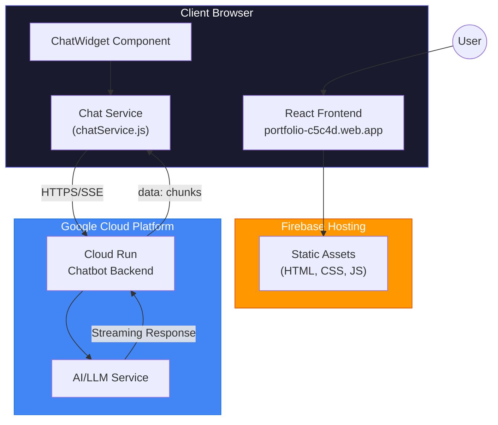
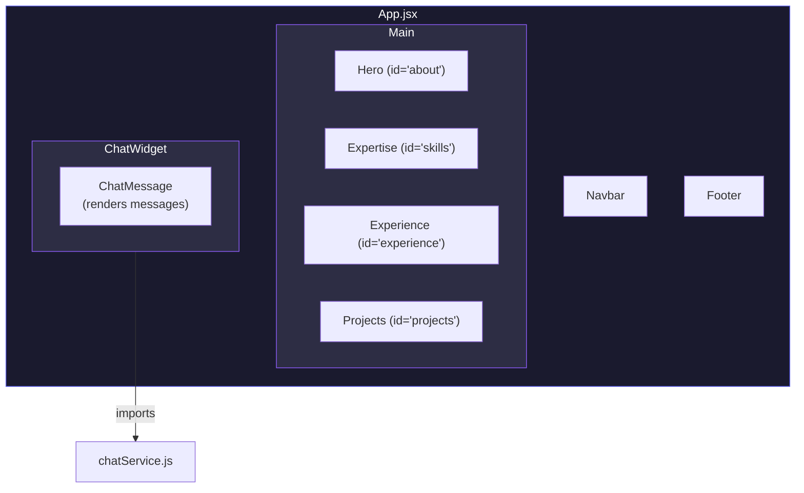
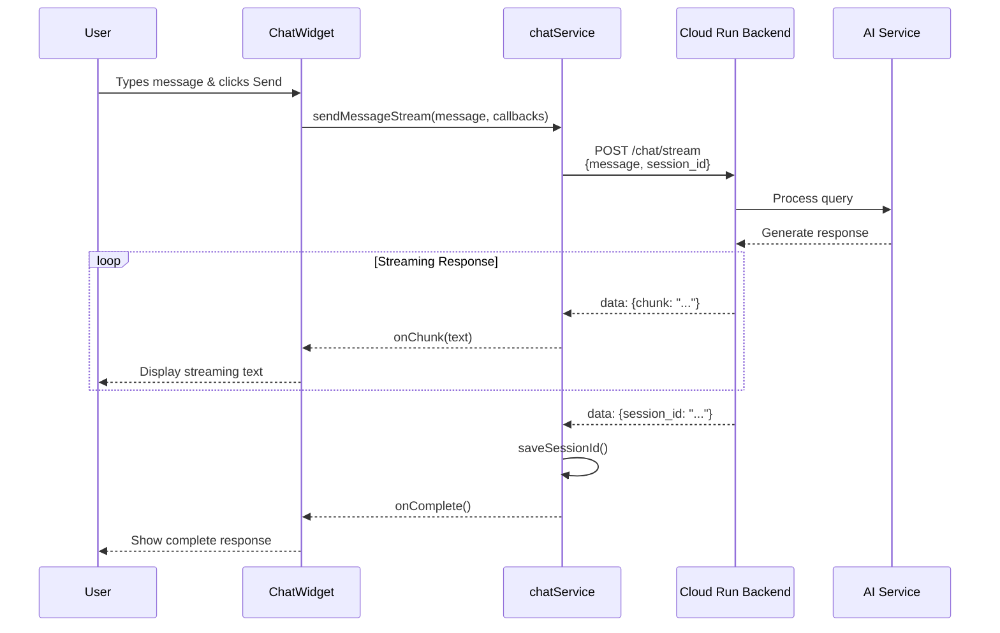
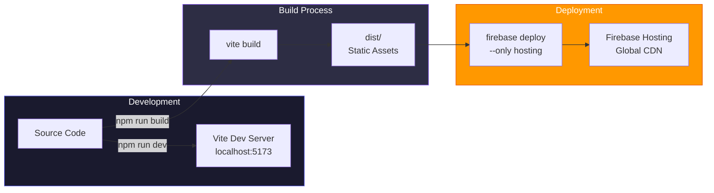
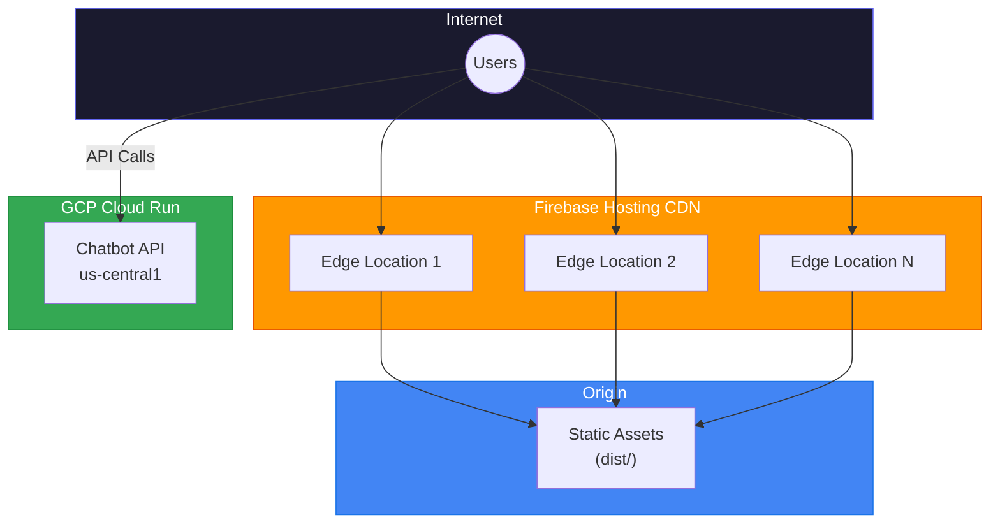
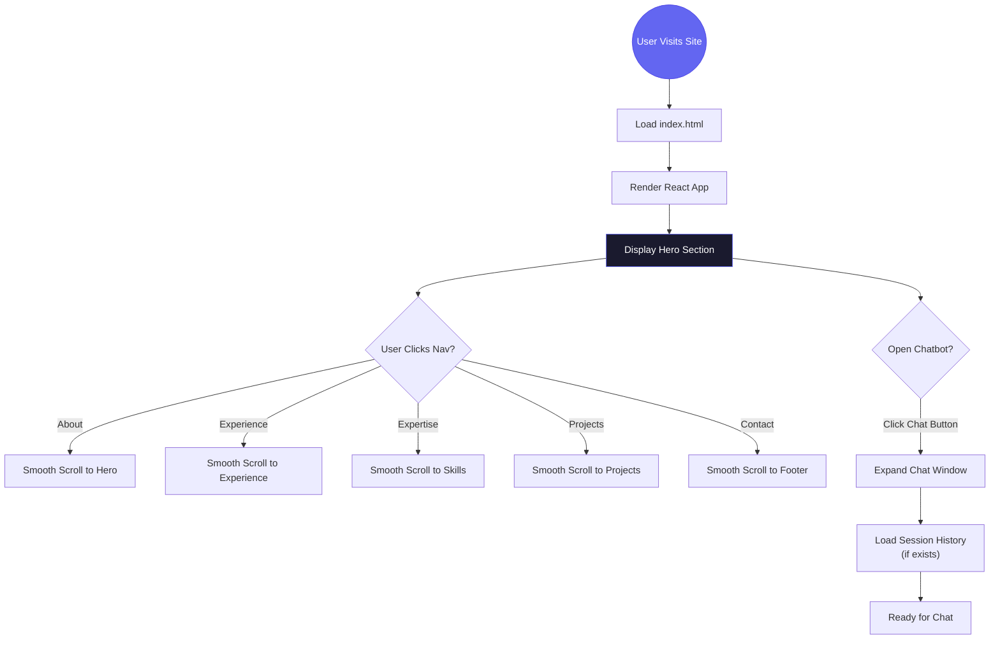
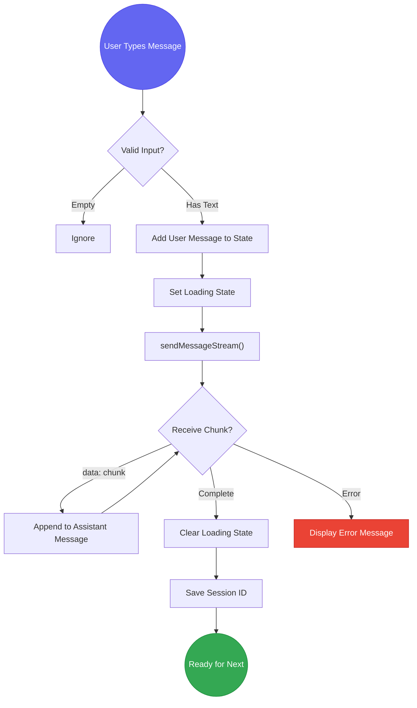

# Portfolio Website & AI Chatbot - Technical Documentation

## Overview

This document provides comprehensive technical documentation for the portfolio website and integrated AI chatbot system. The application showcases a modern, responsive portfolio with an embedded AI assistant that can answer questions about the portfolio owner.

---

## Table of Contents

1. [System Architecture](#system-architecture)
2. [Technology Stack](#technology-stack)
3. [Frontend Components](#frontend-components)
4. [Chatbot Integration](#chatbot-integration)
5. [Deployment Architecture](#deployment-architecture)
6. [Data Flow Diagrams](#data-flow-diagrams)
7. [Development Workflow](#development-workflow)
8. [Configuration](#configuration)

---

## System Architecture

### High-Level Architecture



### Component Architecture



---

## Technology Stack

### Frontend

| Technology | Version | Purpose |
|------------|---------|---------|
| **React** | 19.2.0 | UI Component Library |
| **Vite** | 7.2.4 | Build Tool & Dev Server |
| **Framer Motion** | 12.26.2 | Animations & Transitions |
| **Lucide React** | 0.562.0 | Icon Library |
| **React Icons** | 5.5.0 | Additional Icons |
| **Vanilla CSS** | - | Styling (with CSS Variables) |

### Backend (Chatbot)

| Technology | Purpose |
|------------|---------|
| **Google Cloud Run** | Serverless Container Hosting |
| **AI/LLM Service** | Natural Language Processing |
| **Server-Sent Events (SSE)** | Real-time Streaming Responses |

### Deployment & Infrastructure

| Service | Purpose |
|---------|---------|
| **Firebase Hosting** | Static Site Hosting (CDN) |
| **Firebase CLI** | Deployment Automation |

---

## Frontend Components

### Component Hierarchy

```
src/
├── main.jsx              # App entry point
├── App.jsx               # Root component
├── index.css             # Global styles & CSS variables
├── components/
│   ├── Navbar.jsx        # Navigation with smooth scroll
│   ├── Hero.jsx          # Hero section with profile
│   ├── Expertise.jsx     # Skills/expertise cards
│   ├── Experience.jsx    # Work experience timeline
│   ├── Projects.jsx      # Project portfolio grid
│   ├── Footer.jsx        # Contact info & social links
│   ├── ChatWidget.jsx    # AI chatbot interface
│   └── ChatMessage.jsx   # Individual chat message
└── lib/
    └── chatService.js    # Chatbot API communication
```

### Component Descriptions

| Component | Description |
|-----------|-------------|
| **Navbar** | Sticky navigation with logo, nav links, and smooth scrolling |
| **Hero** | Profile section with photo, name, title, and CTA buttons |
| **Expertise** | Skills cards showcasing technical competencies |
| **Experience** | Timeline of professional work experience |
| **Projects** | Grid display of portfolio projects |
| **Footer** | Contact information, social links, and copyright |
| **ChatWidget** | Floating AI chatbot with expandable chat window |
| **ChatMessage** | Renders individual user/assistant messages |

---

## Chatbot Integration

### Chatbot Architecture



### Chat Service API

The `chatService.js` module provides the following functions:

```javascript
// Session Management
getSessionId()      // Retrieve session ID from localStorage
saveSessionId(id)   // Store session ID in localStorage
clearSession()      // Remove session from localStorage

// API Communication
sendMessageStream(message, onChunk, onComplete, onError)
                    // Send message with streaming response
getSessionHistory() // Retrieve conversation history
```

### API Endpoints

| Endpoint | Method | Description |
|----------|--------|-------------|
| `/chat/stream` | POST | Send message, receive streaming response |
| `/session/{id}/history` | GET | Retrieve conversation history |

### Request/Response Format

**Request:**
```json
{
  "message": "Tell me about your experience",
  "session_id": "abc123-session-id"
}
```

**Streaming Response (SSE):**
```
data: {"chunk": "I have over "}
data: {"chunk": "17 years of "}
data: {"chunk": "experience..."}
data: {"session_id": "abc123-session-id"}
```

---

## Deployment Architecture

### Deployment Flow



### Infrastructure Diagram



---

## Data Flow Diagrams

### User Navigation Flow



### Chatbot Message Flow



---

## Development Workflow

### Local Development

```bash
# Install dependencies
npm install

# Start development server (with hot reload)
npm run dev
# → Runs on http://localhost:5173

# Build for production
npm run build
# → Outputs to dist/

# Preview production build
npm run preview

# Deploy to Firebase
firebase deploy --only hosting
# → Deploys to https://portfolio-c5c4d.web.app
```

### Development Proxy Configuration

For local development, API calls are proxied to avoid CORS issues:

```javascript
// vite.config.js
export default defineConfig({
  plugins: [react()],
  server: {
    proxy: {
      '/api': {
        target: 'https://chatbot-backend-822791247982.us-central1.run.app',
        changeOrigin: true,
        rewrite: (path) => path.replace(/^\/api/, '')
      }
    }
  }
})
```

---

## Configuration

### Environment Variables

| Variable | Development | Production |
|----------|-------------|------------|
| `VITE_CHATBOT_API_URL` | `/api` (proxied) | `https://chatbot-backend-822791247982.us-central1.run.app` |

**Development (.env.development):**
```
VITE_CHATBOT_API_URL=/api
```

### Firebase Configuration

**firebase.json:**
```json
{
  "hosting": {
    "public": "dist",
    "ignore": ["firebase.json", "**/.*", "**/node_modules/**"],
    "rewrites": [
      { "source": "**", "destination": "/index.html" }
    ]
  }
}
```

---

## Key Design Decisions

### 1. Streaming Responses
The chatbot uses Server-Sent Events (SSE) for real-time streaming responses, providing a responsive user experience as answers are generated.

### 2. Session Persistence
Session IDs are stored in `localStorage`, allowing conversation history to persist across page refreshes.

### 3. Vanilla CSS
The project uses vanilla CSS with CSS custom properties (variables) for theming, avoiding external CSS frameworks for maximum control and smaller bundle size.

### 4. Component-Based Architecture
React components are organized by feature, with clear separation between:
- **Layout components** (Navbar, Footer)
- **Content sections** (Hero, Experience, Projects)
- **Interactive features** (ChatWidget, ChatMessage)

### 5. Smooth Navigation
All navbar links use smooth scrolling with `scrollIntoView({ behavior: 'smooth' })` for polished user experience.

---

## URLs & Resources

| Resource | URL |
|----------|-----|
| **Live Website** | https://portfolio-c5c4d.web.app |
| **Chatbot API** | https://chatbot-backend-822791247982.us-central1.run.app |
| **Firebase Console** | https://console.firebase.google.com/project/portfolio-c5c4d |

---

*Documentation generated: January 2026*
